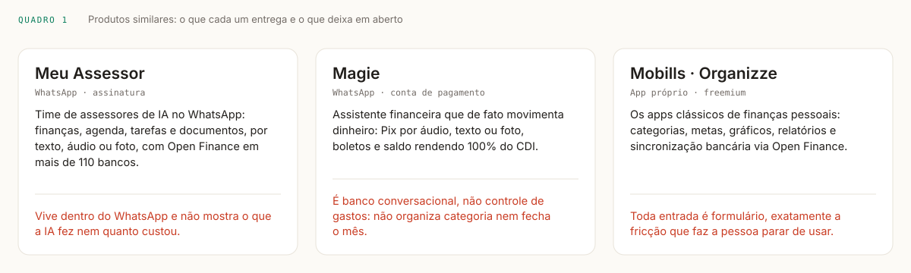
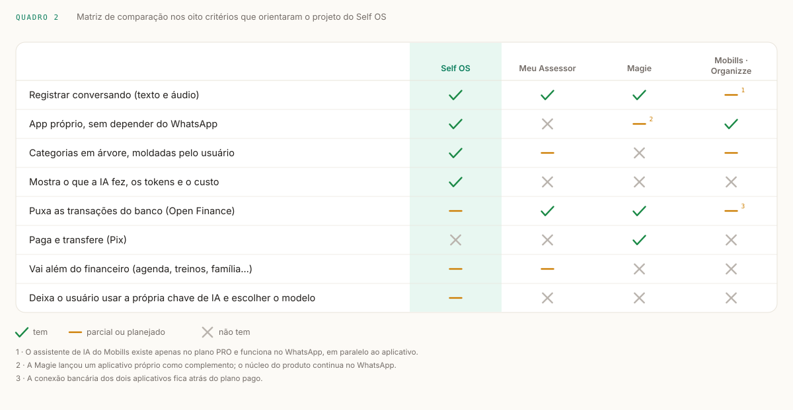

# Produtos similares

**Laboratório de Desenvolvimento de Software · ADS · IFRS Campus Canoas**
Produto proposto: **Self OS**, auxiliar financeiro pessoal por conversa.
Produtos analisados: **Meu Assessor**, **Magie**, **Mobills e Organizze**.
27 de agosto de 2026.

---

## Por que estes três

O Self OS é um auxiliar financeiro pessoal em que o usuário registra e consulta gastos e receitas conversando, por texto ou por áudio, e o sistema organiza os gastos numa hierarquia de categorias que ele mesmo molda. A aposta do produto não está em ter mais relatórios do que os concorrentes: está em cobrar uma frase pelo registro, em vez de um formulário.

Quem já ataca esse mesmo problema se divide em duas famílias, e por isso a análise pega as duas. De um lado, os assistentes de IA que vivem no WhatsApp: o **Meu Assessor**, que trata finanças como um dos assuntos de uma equipe de assessores, e a **Magie**, que leva a conversa até o extremo de movimentar dinheiro de verdade. Do outro, os aplicativos clássicos de finanças pessoais brasileiros, **Mobills** e **Organizze**, analisados juntos porque ocupam a mesma posição de mercado e oferecem essencialmente o mesmo conjunto de funcionalidades.

Os dois quadros a seguir resumem a comparação: o primeiro descreve cada produto em uma frase do que ele faz e uma do que lhe falta; o segundo cruza os oito critérios que importam para a decisão de projeto do Self OS. O texto depois deles destrincha produto por produto.

---

## 1. Meu Assessor

**Canal:** WhatsApp · **Modelo:** assinatura mensal · **Foco:** assistente pessoal com finanças dentro

O Meu Assessor vende algo maior do que um controle de gastos: uma equipe de assessores de inteligência artificial que atende pelo WhatsApp. O produto personifica cada frente em um assistente com nome próprio, um coordenando a operação e os demais cuidando de finanças, agenda e documentos, e o usuário fala com todos no mesmo fio de conversa. A entrada é multimodal por princípio: texto, áudio e foto valem igualmente, então mandar a foto de um comprovante é tão válido quanto descrever a compra.

Na parte financeira, o diferencial mais forte é a conexão via Open Finance com mais de cento e dez instituições, o que faz saldos, extratos e faturas de cartão aparecerem sozinhos, sem ninguém digitar nada. É a resposta mais radical possível ao problema da fricção: em vez de facilitar o registro, elimina o registro. O produto se posiciona explicitamente sobre segurança e conformidade com a LGPD, o que é coerente com quem pede autorização bancária.

Para o Self OS, é o concorrente conceitualmente mais próximo, porque também parte da ideia de que um assistente conversacional pode organizar a vida pessoal inteira e não só o dinheiro. A diferença de projeto está em onde o produto mora e no quanto ele se deixa auditar.

**Funcionalidades**

- Conversa por texto, áudio e foto no WhatsApp
- Assessores especializados em finanças, agenda, tarefas, projetos e documentos
- Conexão Open Finance com mais de 110 bancos
- Visão unificada de saldo, extrato e cartões em tempo real
- Cobranças, lembretes e organização de arquivos
- Assinatura mensal, sem instalação de aplicativo

**Pontos positivos**

- Adoção quase sem barreira: o canal já está instalado e é usado o dia inteiro
- Multimodalidade real, com foto e áudio no mesmo nível do texto
- Open Finance elimina a digitação em vez de apenas reduzi-la
- Escopo além do financeiro, o que aumenta a frequência de uso
- Discurso claro de segurança e LGPD, que é o ponto sensível de quem conecta banco

**Pontos negativos**

- Não existe fora do WhatsApp: o histórico financeiro se mistura à conversa pessoal e depende das regras de uma plataforma de terceiros
- Sem telas próprias, revisar o mês no computador é desconfortável, e conferir o mês é justamente o momento em que a lista importa
- A IA é caixa-preta: não há registro do que ela executou, de qual modelo respondeu nem de quanto custou
- A categorização não é uma árvore moldada pelo usuário
- Assinatura recorrente para um serviço que, sem app, é difícil de levar embora

---

## 2. Magie

**Canal:** WhatsApp · **Modelo:** conta de pagamento · **Foco:** movimentar dinheiro por conversa

A Magie nasceu em 2024 e leva a conversa ao limite: em vez de anotar o que já aconteceu, ela executa a transação. O usuário manda um áudio, uma mensagem ou a foto de um boleto e a assistente faz o Pix, paga a conta, agenda o pagamento ou cria o lembrete, tudo dentro do WhatsApp. O saldo parado rende 100% do CDI automaticamente. A tração é significativa para um produto tão novo: mais de quatrocentos mil usuários e mais de dois bilhões de reais transacionados, com uma rodada de cinco milhões de dólares e a abertura de uma vertical B2B.

Vale registrar a estrutura por trás, porque ela é um risco relevante numa análise de produto financeiro: a Magie não é uma instituição de pagamento autorizada pelo Banco Central e opera por meio de parceiros regulados, uma provedora de banking as a service e uma iniciadora de pagamentos do Open Finance. Funciona, mas coloca o dinheiro do usuário a uma camada de distância da empresa com quem ele acha que está falando.

Para o Self OS, a Magie serve como o contraexemplo mais útil da análise. Ela prova que a interface conversacional aguenta a operação mais delicada que existe, transferir dinheiro, e ao mesmo tempo mostra que resolver o pagamento não é o mesmo que resolver o controle. Depois de um mês inteiro de Pix pela Magie, o usuário sabe quanto saiu, mas continua sem saber em quê gastou.

**Funcionalidades**

- Pix por áudio, texto ou foto, sem sair do WhatsApp
- Leitura, agendamento e pagamento de boletos
- Conta com saldo rendendo 100% do CDI
- Lembretes financeiros e consulta de saldo
- Conta PJ e aplicativo próprio como complementos
- Open Finance por meio de iniciadora parceira

**Pontos positivos**

- A menor fricção possível: o registro e o pagamento acontecem no mesmo gesto
- Entrada por foto resolve o boleto, que é onde o formulário mais incomoda
- Rendimento automático sem o usuário precisar fazer nada
- Escala já comprovada em volume transacionado e base de usuários

**Pontos negativos**

- É um banco conversacional, não um controle de gastos: não há hierarquia de categorias nem fechamento de mês
- Só enxerga o dinheiro que passa por ela; o gasto no cartão de outro banco fica de fora
- Nenhuma auditoria do que a IA fez, o que é grave justamente porque as ações movem dinheiro
- Opera sem licença própria, apoiada em parceiros regulados
- O núcleo do produto continua preso ao WhatsApp, com o app em papel secundário

---

## 3. Mobills e Organizze

**Canal:** app próprio e web · **Modelo:** freemium · **Foco:** controle financeiro completo por formulário

Mobills e Organizze são os dois aplicativos de finanças pessoais mais conhecidos do Brasil e entram nesta análise como um bloco, porque ocupam a mesma posição de mercado e oferecem praticamente o mesmo conjunto de funcionalidades. São produtos maduros, o Mobills passa de dez milhões de usuários, com aplicativo para Android e iOS, acesso pelo navegador e um plano gratuito que já resolve o básico.

A profundidade funcional é o ponto forte e nenhum assistente de WhatsApp chega perto: gestão de cartão de crédito com fatura, metas financeiras, orçamento por categoria, gráficos e relatórios de fluxo de caixa mensal e anual, filtros por conta, categoria e etiqueta, anexo de recibos, alertas de vencimento, uso offline com sincronização em nuvem e exportação em Excel, OFX e PDF. Nos planos pagos entra a conexão bancária via Open Finance, que importa os lançamentos com um clique, e o Mobills chegou a acoplar um assistente de IA no WhatsApp ao seu plano mais caro, o que mostra que a própria categoria já reconhece o problema.

O que os define, porém, é o caminho de entrada. Fora da importação bancária, cadastrar um gasto significa abrir o app, achar a tela, escolher a conta, escolher a categoria, digitar o valor e confirmar. É uma sequência curta em si mesma, e é exatamente a fricção que faz a pessoa desistir depois de uma semana, deixando o extrato do mês incompleto e, portanto, sem serventia. O Self OS existe por causa desse abandono.

**Funcionalidades**

- Lançamento manual de receitas e despesas por formulário
- Categorias, etiquetas e orçamento por categoria
- Gestão de cartão de crédito e fatura
- Metas financeiras e alertas de vencimento
- Gráficos e relatórios de fluxo de caixa mensal e anual
- Conexão bancária via Open Finance nos planos pagos
- App Android e iOS, acesso web, uso offline com sincronização
- Anexo de recibos e exportação em Excel, OFX e PDF

**Pontos positivos**

- Maturidade e amplitude funcional muito acima das alternativas conversacionais
- Telas próprias e boas para o momento de revisar e fechar o mês
- Funcionam offline e sincronizam depois
- Exportação aberta, então o usuário consegue levar os próprios dados embora
- Plano gratuito utilizável, o que reduz a barreira de experimentação

**Pontos negativos**

- Toda entrada manual é formulário, e é aí que o uso morre
- As categorias são listas rasas ou de dois níveis, sem uma árvore que o usuário molde
- O que remove a digitação, a conexão bancária, está atrás do paywall
- A IA, quando existe, é um adendo do plano mais caro e ainda vive no WhatsApp
- Nenhuma transparência sobre o que a automação fez em nome do usuário

---

## Onde o Self OS se encaixa

Nenhum dos três junta as três coisas ao mesmo tempo: registro por conversa, aplicativo próprio para revisar o mês e transparência sobre o que a IA fez.

Os assistentes de WhatsApp acertam a entrada e erram a revisão, porque uma conversa não é lugar de conferir um extrato, e nenhum deles presta contas do que executou. Os apps clássicos acertam a revisão e erram a entrada, porque exigem exatamente o formulário que faz a pessoa parar de usar. O Self OS ocupa o vão entre os dois: a conversa como caminho principal de registro, telas próprias de gastos, receitas, fatura e categorias para conferir o resultado, e uma árvore de categorias que o usuário molda no lugar de uma lista fixa.

A diferença que nenhum concorrente apresenta é o log da IA. Toda mensagem processada fica registrada com o modelo usado, os tokens consumidos, o custo e as ferramentas que rodaram, e o cartão de confirmação só aparece depois que a escrita no banco voltou com sucesso. Nos três produtos analisados, o usuário precisa acreditar no que a IA diz ter feito. Aqui ele pode conferir, e é isso que separa uma resposta convincente de um registro correto.

---

## Fontes consultadas

- [meuassessor.com](https://meuassessor.com/) — página oficial do Meu Assessor
- [magie.com.br](https://magie.com.br/app) — página oficial da Magie
- [Startups](https://startups.com.br/negocios/fintech/magie-capta-us-5-milhoes-e-cria-vertical-b2b-para-pagamentos-via-whatsapp/) — Magie capta US$ 5 milhões e cria vertical B2B
- [Fast Company Brasil](https://fastcompanybrasil.com/money/como-a-ia-mudou-o-pix-agora-tem-pagamento-por-audio-no-whatsapp/) — pagamento por áudio no WhatsApp
- [mobills.com.br/pricing](https://www.mobills.com.br/pricing/) — planos Premium e PRO do Mobills
- [Central de ajuda do Mobills](https://mobills.zendesk.com/hc/pt-br/articles/39727734628251-Tudo-sobre-o-Mobills-PRO) — o que o plano PRO inclui
- [organizze.com.br](https://www.organizze.com.br/app-de-financas/) — funcionalidades e conexão bancária
